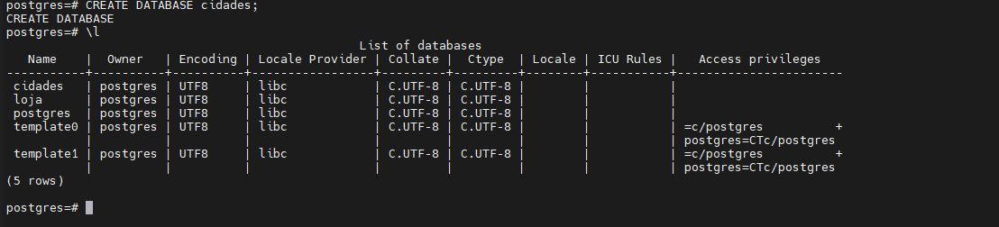
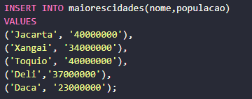

## Criem um novo banco de dados "cidades"

## Criar uma tabela chamada "maiorescidades e Adicionar como, colunas: id, nome, populacao"

## Inserir registros das 5 maiores cidades do mundo 

## Consultar os 5 registros
