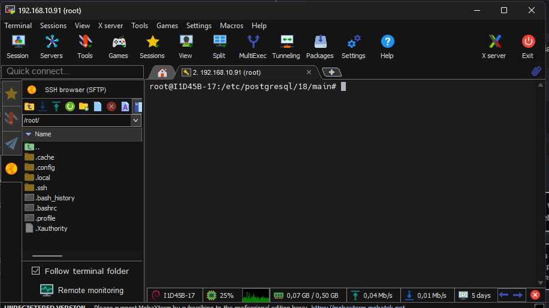

## SGBT
Instalar e configurar o **SGBT PostgreeSQL**
 
 **Comando para instalas o SGBT :**
``bash
mermaid 
sudo apt insyall -y postgresql``
>Obs : O comando sudo, no nosso caso pode ser omitido 
---
Realizando verificação SGBD :
```bash
pg_lsclusters
```

Para realizar o acesso SGBD **SEM SENHA**, utilizar comando:

``` bash
sudo -u postgres psql
```
>Com esse comando o acesso é feito sem senha, pois o LINUX ja provou quem é você (root).                              Autenticação PEER.

Para primeiro acesso, alterei a senha :

```sql
ALTER USER postgres PASSWORD '13069016';
```

>O retorno correto é `ALTER ROLE`.

Para sair do postgres, comando `\q` (Igual `\quit` nos jogos).


---

## Configurações de serviço 
Caminho padrão para as configurações do postgres



Primeira configuração :
```bash
sudo nano postgresql.conf
``` 
CTRL + W    para buscar a linha do listen_addresses e descomentamos, alterando para `*`

Se ficar localhost somente meu pc acessa.

Passo 2:
``` bash
sudo nano pg_hba.conf
```
Nas ultimas linhas adicionei: 
host all all 10.87.38.0/24 scram-sha-256

Para criar um banco de dados usamos o comando: 
```sql
CREATE DATABASE lojaMax;
```

Para vizualizar os bancos:
```bash
\l
``` 
