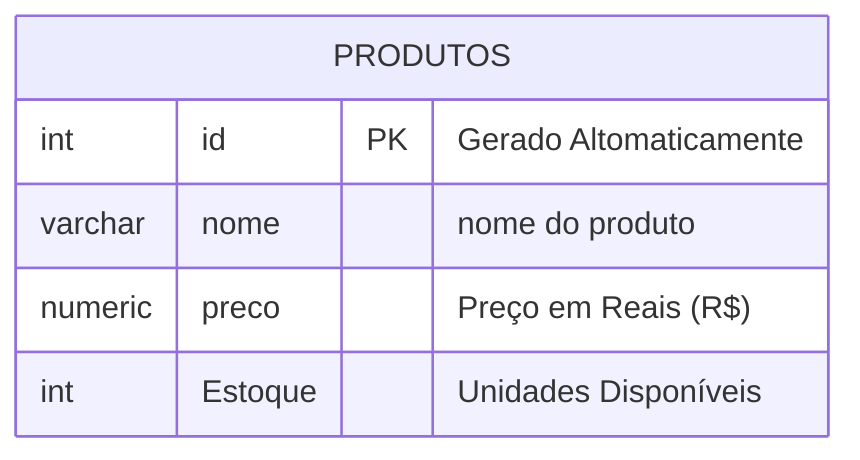

## Aula 02
Comando para apagar um banco de dados:

```SQL
DROP DATABASE lojamax;
```
---
Comando para criar um banco de dados:

```SQL
CREATE DATABASE lojamax;
```
---
O objetivo é criar uma loja para aprender os principais comandos SQL.


   ---
     Para criarmos a tebela, utilizamos o comando a baixo:
```SQL 
CREATE TABLE produtos(
id INT GENERATED ALWAYS AS IDENTITY PRIMARY KEY,
nome VARCHAR(50) NOT NULL, 
preco NUMERIC(10,2) NOT NULL,
estoque INT NOT NULL DEFAULT 0
); 
```
para postar o produto utilizamos: 
```SQL
# inserindo valores
     INSERT INTO produtos(nome,proco,estoque)
     VALUES('iphone 17','10000.00','15');
```