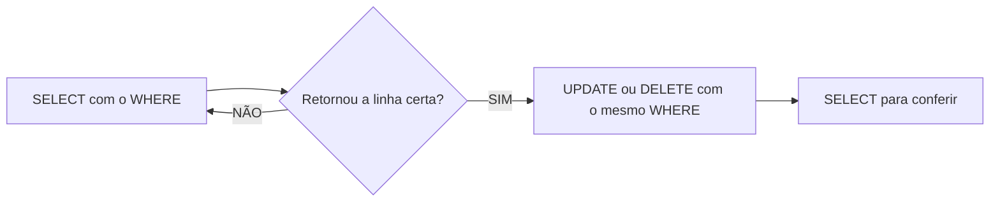

## Aula 05
Para filtras colunas, utilizamos o comando:
```sql
SELECT nome,preco FROM produtos;
```
Para filtro de registro utilizamos o comando:
```sql
SELECT * FROM produtos WHERE estoque < 10;
```
Para ordenar os dados:
```sql
SELECT nome,preco FROM produtos
ORDER BY preco DESC;
```
**UPDATE**: Update ou Delete se, `Where` atinge TODAS as linhas! Não existe Ctrl+Z

Fluxo Seguro (sempre):

---
Tambem é posssivel realizar calculos :
```SQL 
UPDATE maiorescidades
SET populacao = populacao - 3
WHERE id = 2; 
```
---
Para deletar :
```SQL
-SELECT * FROM maiorescidades WHERE nome ='Jacarta'; 
DELETE FROM maiorescidades WHERE nome ='Jacarta';
SELECT * FROM maiorescidades;
```