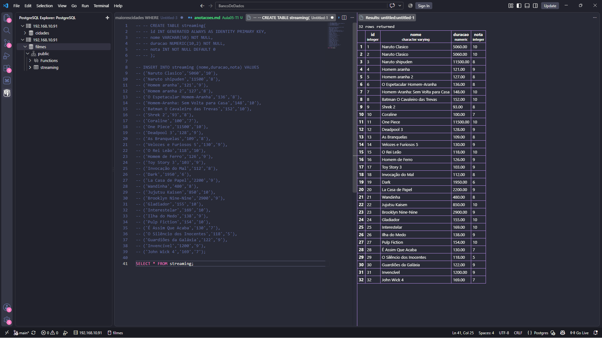
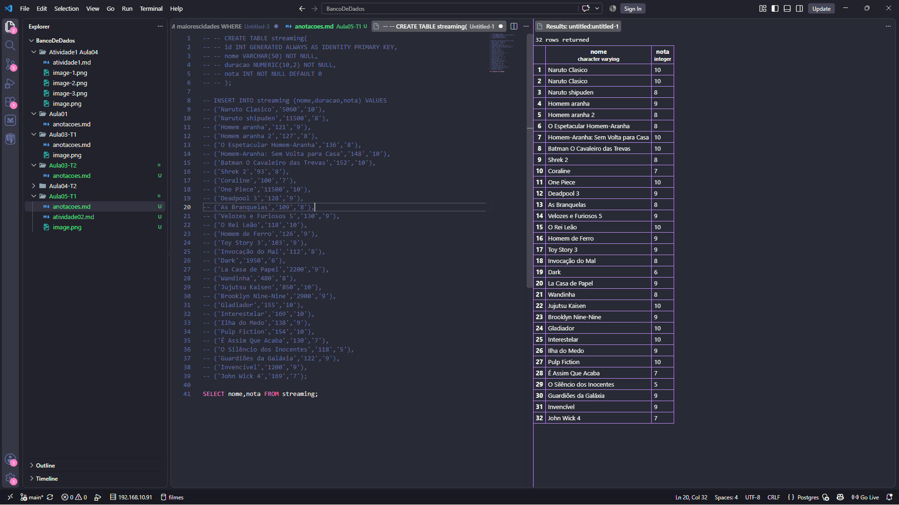
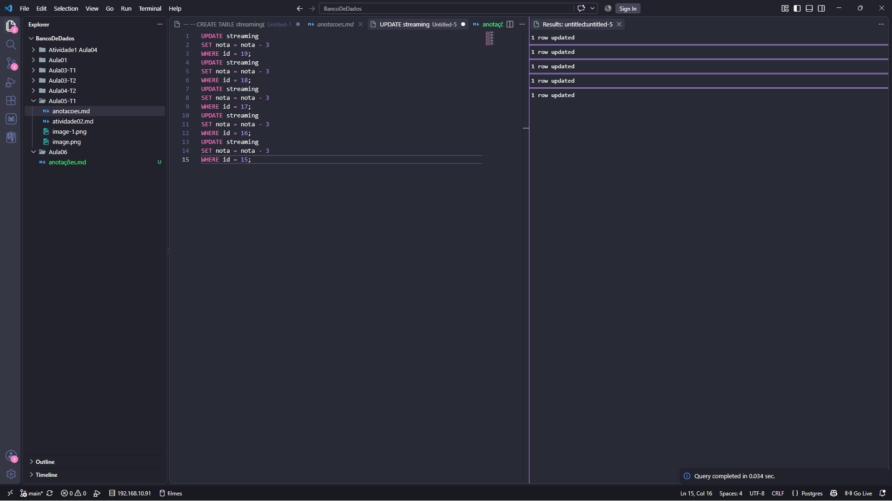
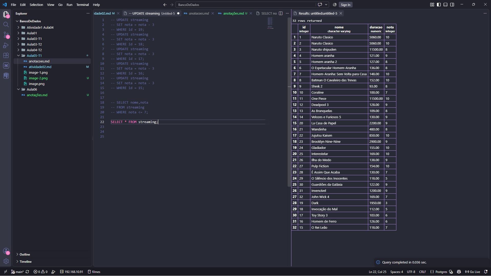
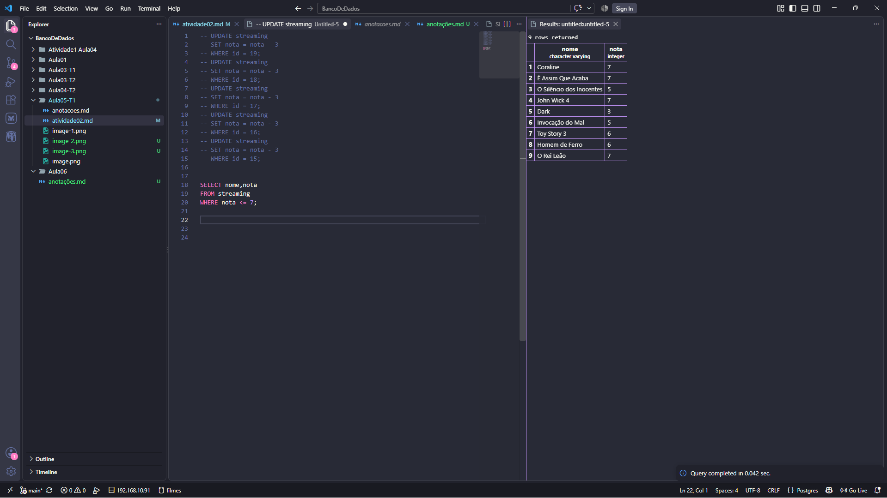
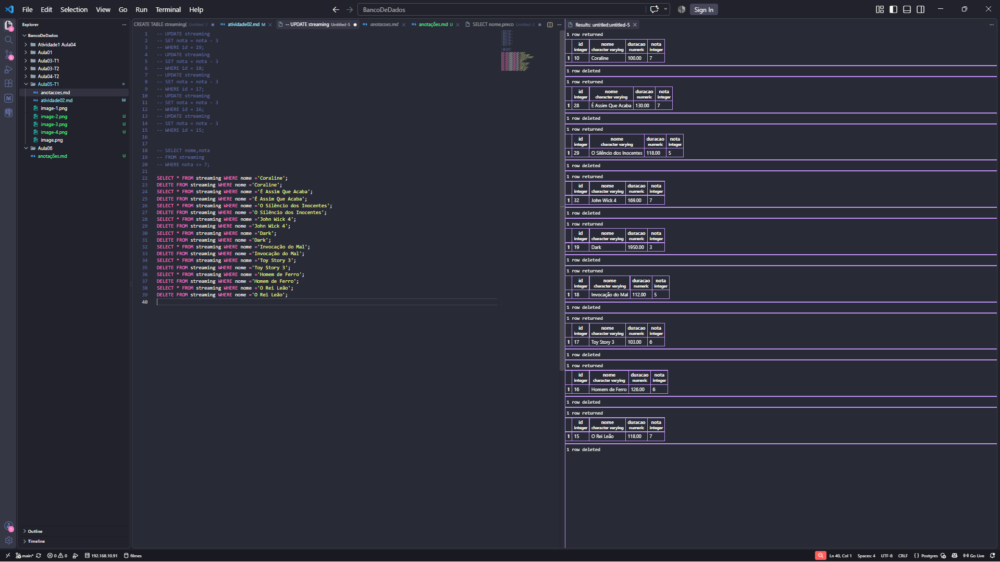

## Primeiro criamos a tabela com nome, avaliação e duração dos filmes:

## Para consutar apenas nome e nota utilizamos:

## Depois altero as notas:

## Depois eu separo para ver quais notas são menores que 7 e as deleto:

