# Início:

-Crie um novo banco de dados para armazenar a tabela de livros 

-Crie uma tabela com as colunas (id,nome,autor,preco,genero,estoque,ano_publicacao)

-Lembre-se de escolher as variáveis adequadas!
Início:

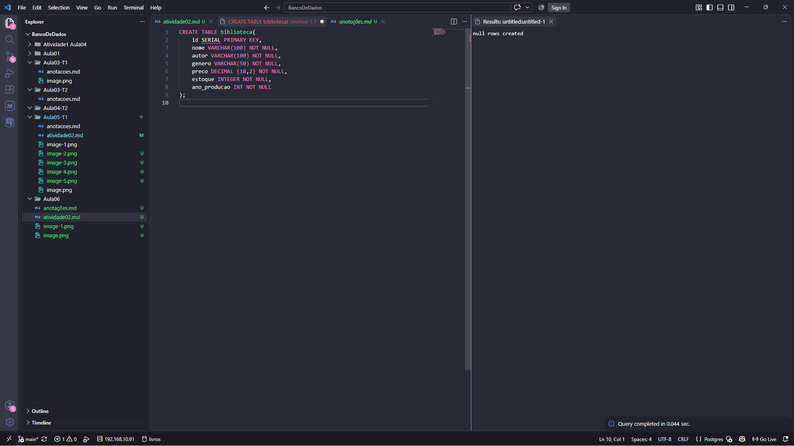

## Exiba todos os dados da tabela, mas limitando o resultado aos 10 primeiros registros.

## Exibi apenas as colunas titulo, autor e preco de todos os livros.

 
## Listei os gêneros distintos existentes na base, em ordem alfabética.
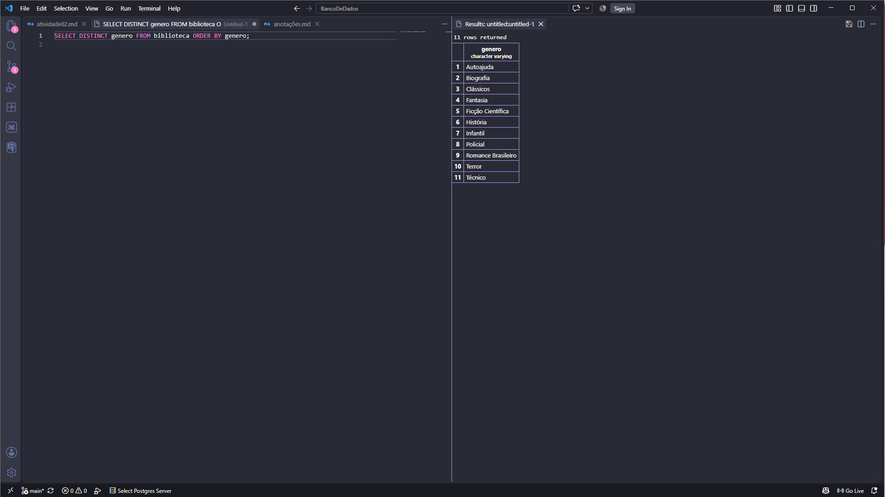

## Descubra quantos autores diferentes existem.
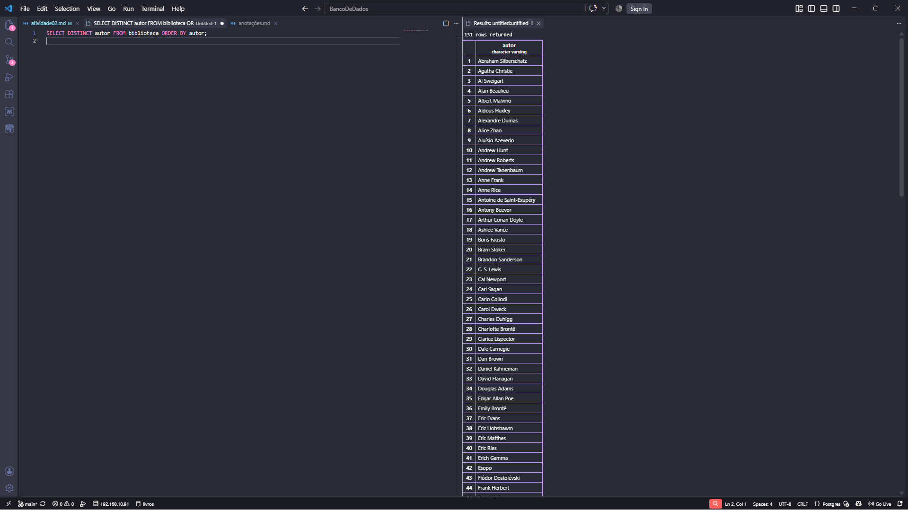
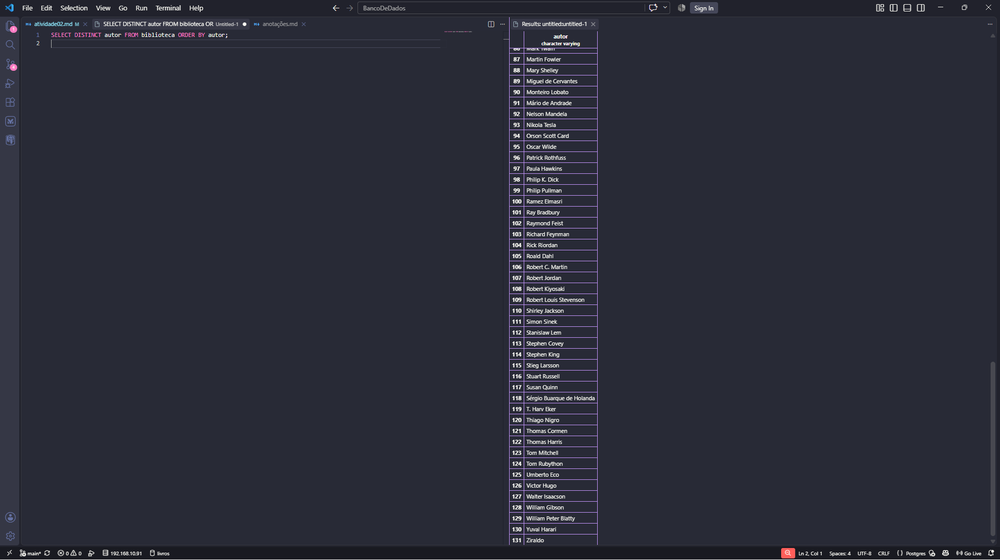

## Liste os 5 livros mais caros da base (título e preço).
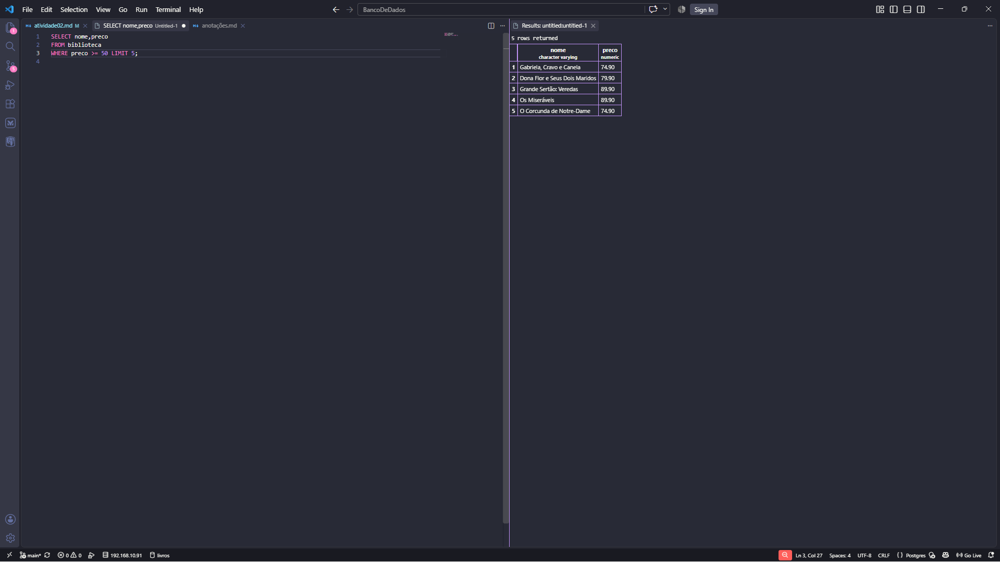

## Liste os 5 livros com menor estoque (título e estoque).
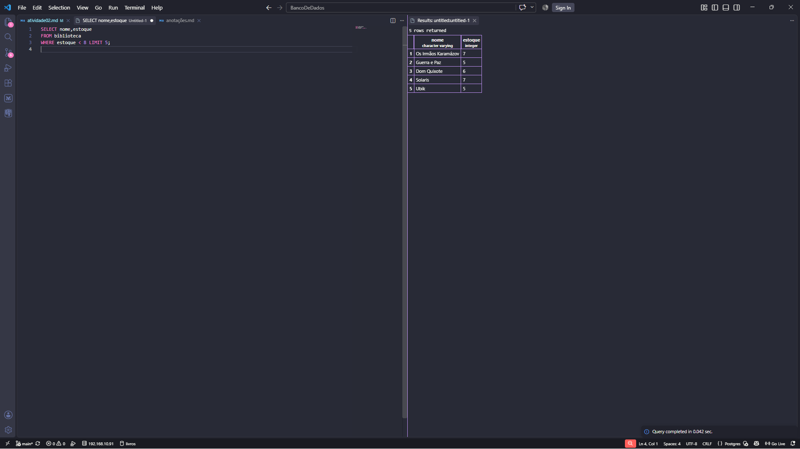

---
# Bloco 2 — Filtros numéricos
---

## Mostre titulo e estoque de todos os livros do gênero Técnico.
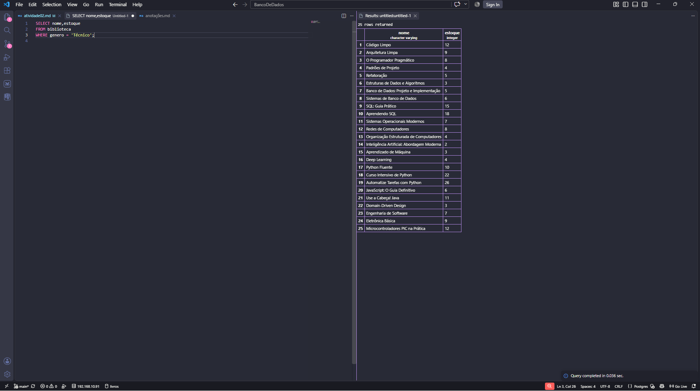

## Mostre titulo e preco dos livros que custam mais de R$ 200,00.
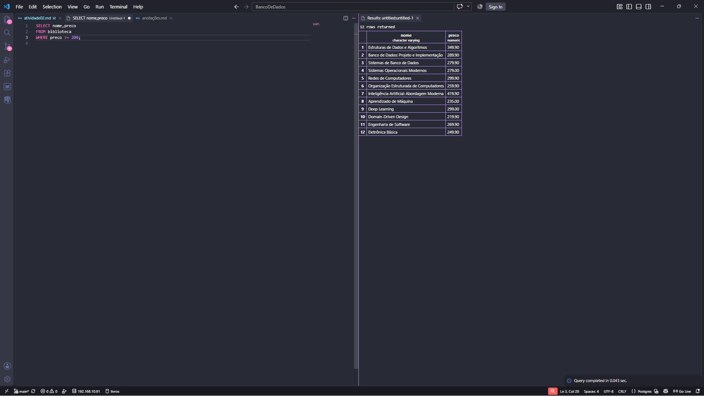

## Mostre titulo e preco dos livros com preço entre R$ 40,00 e R$ 70,00.
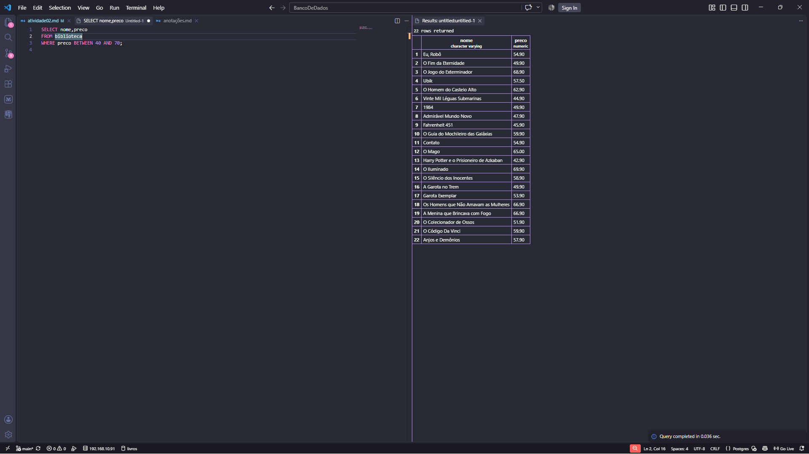

## Mostre os livros com estoque abaixo de 5 unidades (situação de reposição urgente).
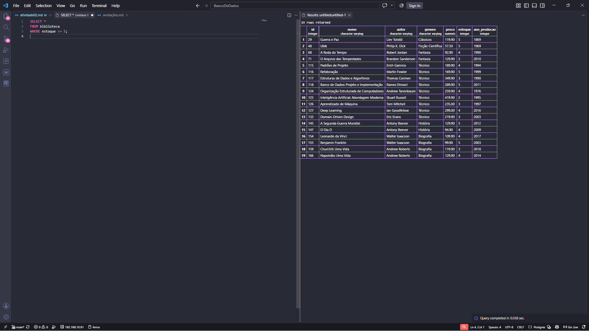

## Liste os livros publicados antes de 1900, ordenados do mais antigo para o mais recente.
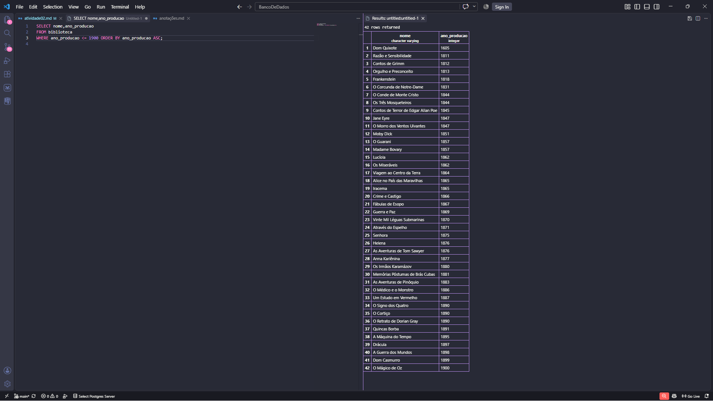

## Liste os livros publicados entre 2010 e 2020, mostrando título, ano e gênero.
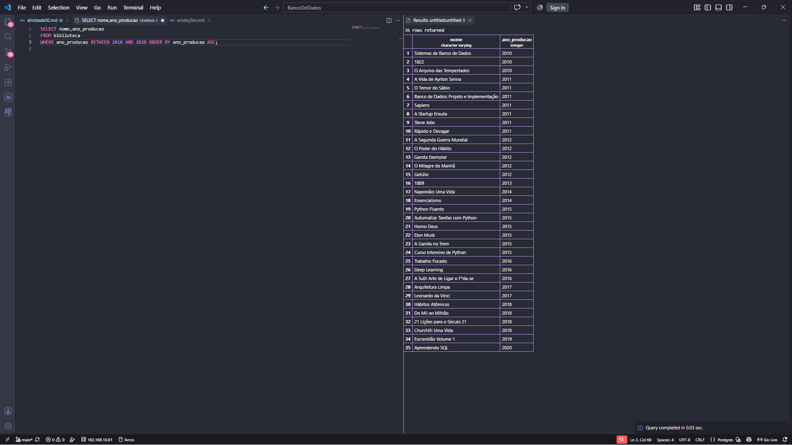