##  Liste o nome e o preço de todos os produtos da categoria Monitores.
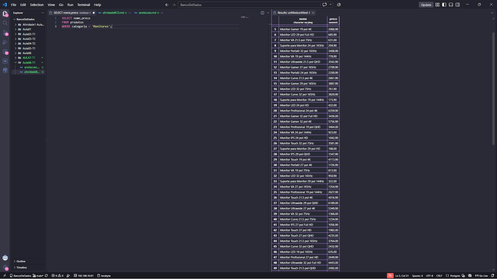
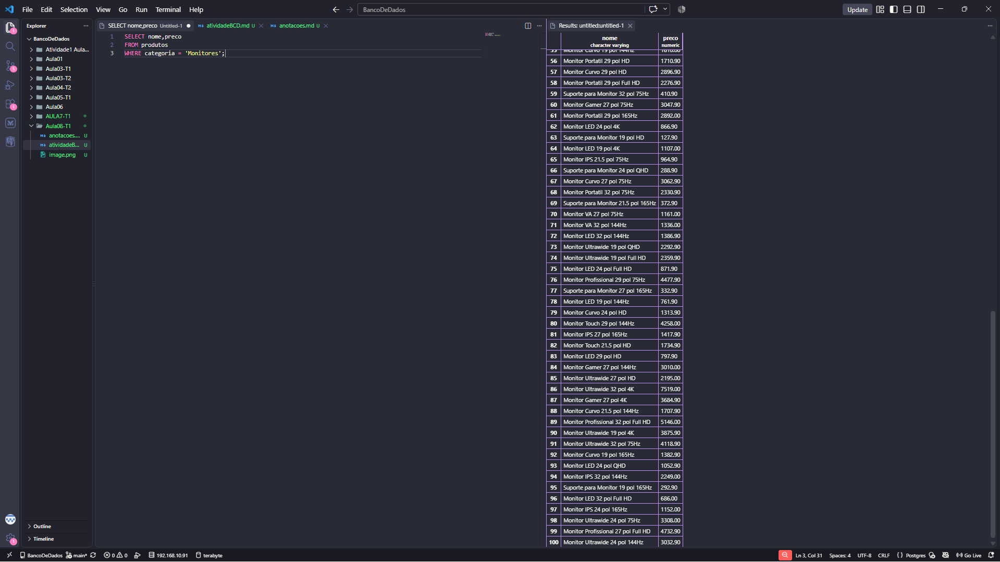

## Liste todos os produtos com estoque menor que 5 unidades, mostrando nome, categoria e estoque.
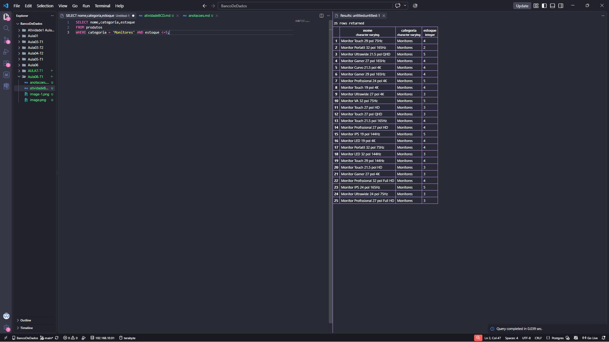

## Liste os 10 produtos mais caros da loja (nome e preço), do mais caro para o mais barato.
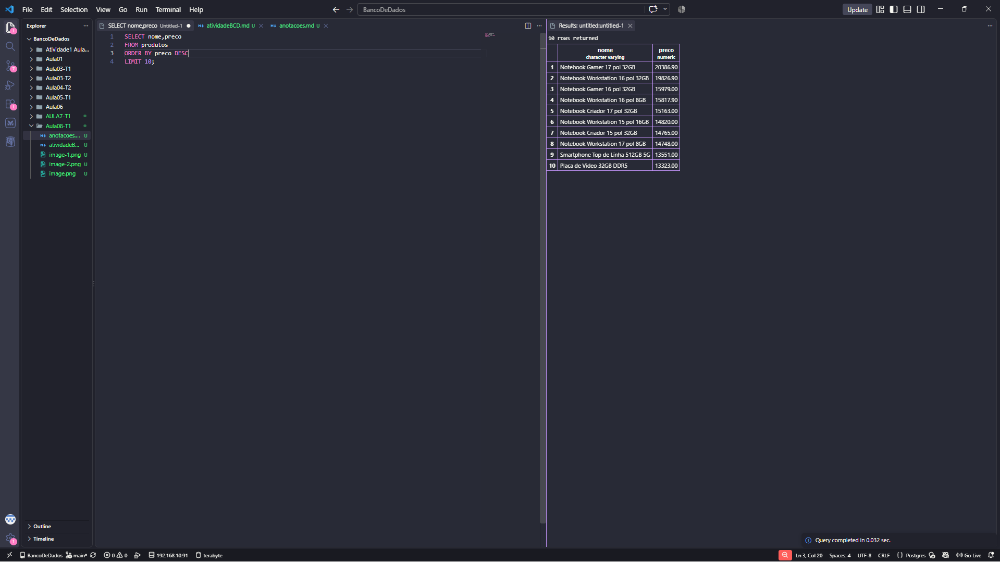

## Liste os produtos da marca Logitech, ordenados por preço crescente.
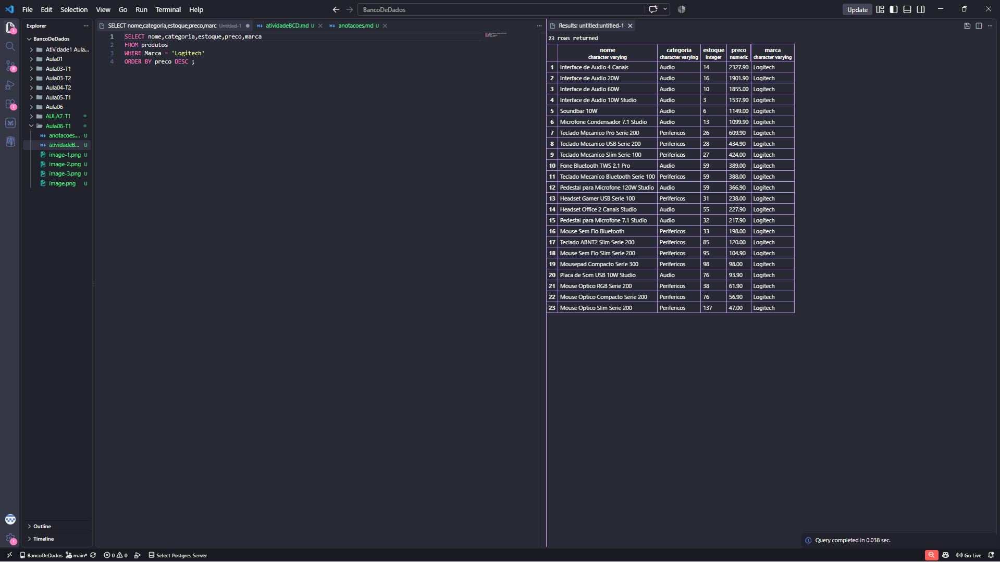
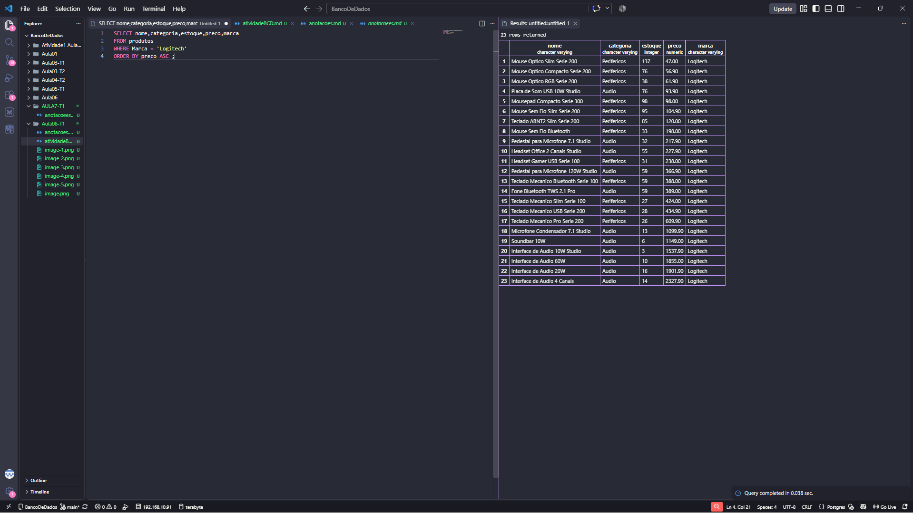

## Liste os produtos com preço entre R$ 100,00 e R$ 500,00, mostrando nome e preço.
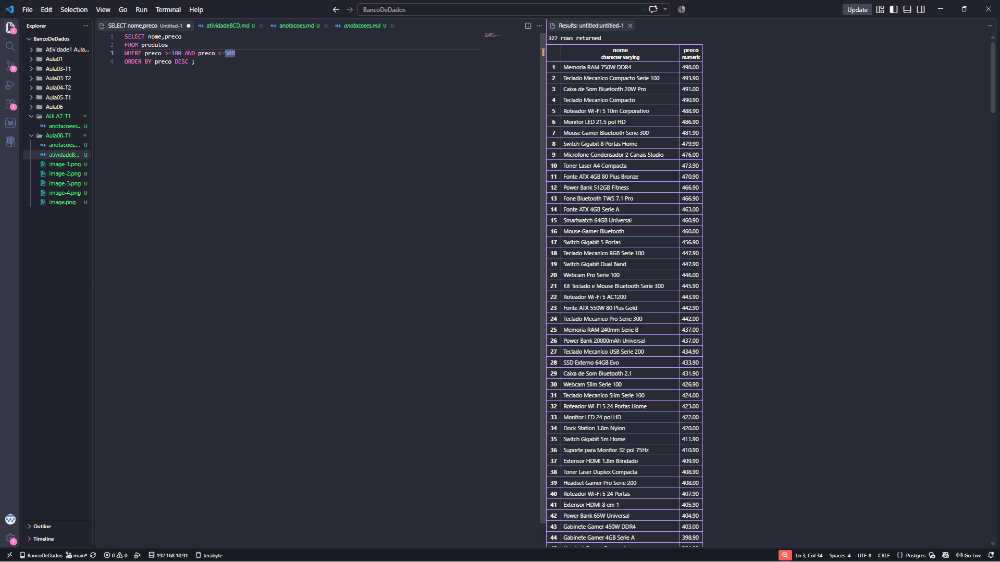

# Parte 2

## Quantos produtos existem cadastrados na loja? Dê ao resultado o nome total_de_produtos.
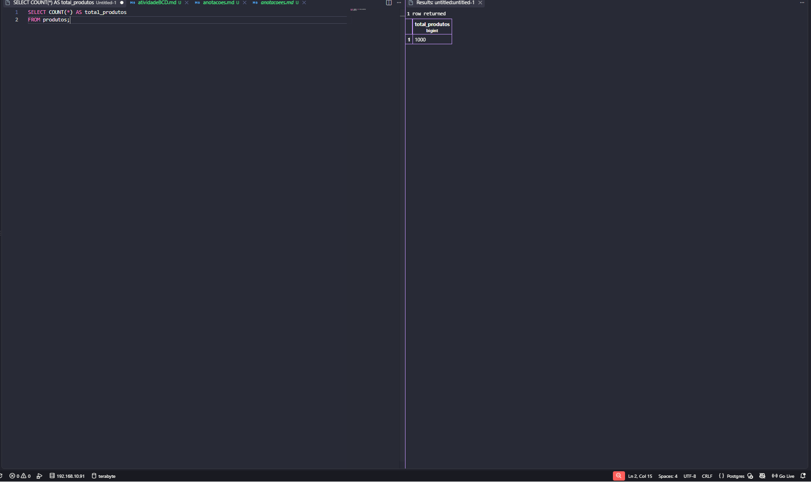

##  Quantos produtos estão com estoque abaixo de 10 unidades? Nomeie a coluna como produtos_em_falta.
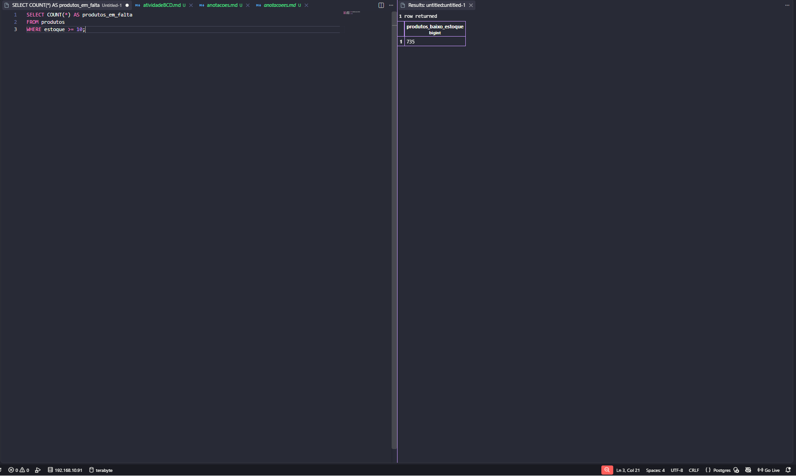

## Qual o maior e o menor preço da loja? Traga os dois na mesma consulta, com os nomes maior_preco e menor_preco.
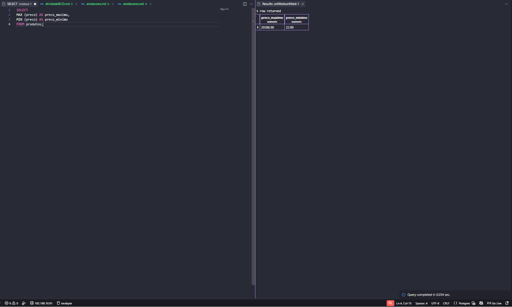

## Qual o preço médio dos produtos da categoria Notebooks, arredondado para 2 casas decimais?
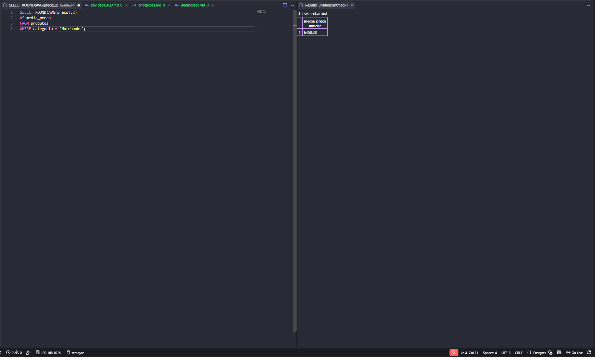

## Quantas peças a loja tem no total, somando o estoque de todos os produtos? Nomeie como total_de_pecas.
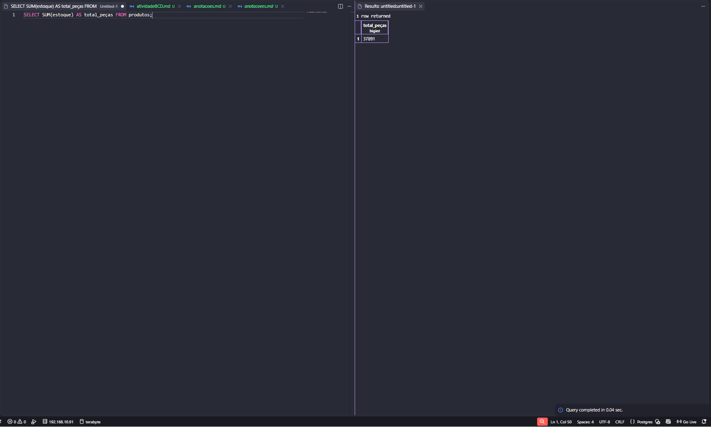

# Parte 3

## Monte um painel resumo em uma única consulta, retornando de uma vez: quantidade de produtos, preço médio (2 casas decimais), maior preço, menor preço e total de peças em estoque. Todas as colunas devem ter nomes compreensíveis para o gerente.
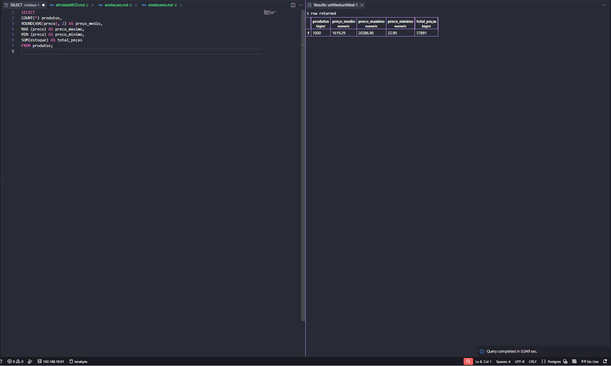

## O valor imobilizado de um produto não está gravado na tabela: ele precisa ser calculado (preço x estoque). Crie a coluna calculada valor_em_estoque e mostre os 5 produtos com maior valor imobilizado, exibindo nome, preço, estoque e o valor calculado.
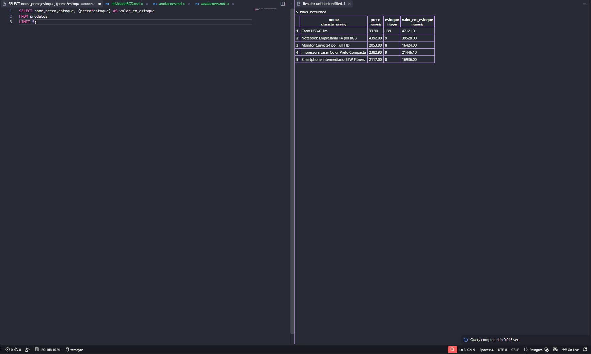

## Compare o resultado de C2 com o produto mais caro que apareceu em A3. É o mesmo item? Escreva duas linhas explicando o que essa comparação revela sobre o estoque da loja.
>Não, não é o mesmo item. O produto mais caro da loja em A3 possui preço de R$ 20.386,90, enquanto o maior valor imobilizado em C2 pertence ao Smartphone Top de Linha 33W, com R$ 68.777,10 em estoque.
>Essa comparação revela que o produto mais caro individualmente não necessariamente representa o maior dinheiro parado, pois o valor imobilizado depende da combinação entre preço e quantidade em estoque