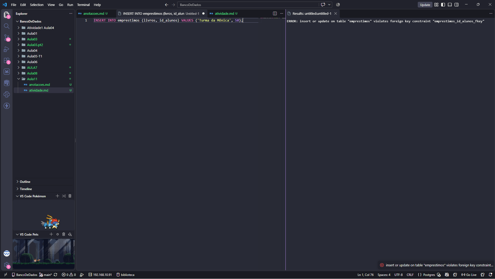

## Atividade

1-Primeiros criamos a tabela Alunos:
```sql
CREATE TABLE alunos(
    id SERIAL PRIMARY KEY,
    nome VARCHAR(50) NOT NULL
);
```
2- Depois Criamos a tabela emprestimos:
```sql
CREATE TABLE emprestimos(
    id SERIAL PRIMARY KEY,
    livros VARCHAR(50) NOT NULL,
    id_alunos INT REFERENCES alunos(id)
);
```
4- Depois adicionamosos alunos:
```sql
INSERT INTO alunos (nome) VALUES
('Moreno'),
('Miguel'),
('Murilo'),
('Lucas'),
('Gabriel'),
('Felipe'),
('Eduardo'),
('Feboli'),
('Cazzotti'),
('Pietro');
```
5-Depois adicionamos os livros que cada aluno pegou:
```sql
INSERT INTO emprestimos (livros,id_alunos) VALUES
('Dom Casmurro',1),
('1984 (George Orwell)',7),
('Cem Anos de Solidão',2),
('O Hobbit',4),
('A Hora da Estrela',10);
```
6- Depois mostramos todos os alumos:
```sql
SELECT * FROM alunos;
```
7-Para mostrar apenas quais alunos pegaram livros :
```sql
SELECT alunos.nome,emprestimos.livros
FROM emprestimos 
INNER JOIN alunos ON emprestimos.id_alunos = alunos.id;
```
8-Para mostrar todos os alunos até os que não pegaram livros utilize:
```sql
SELECT alunos.nome,emprestimos.livros
FROM alunos
LEFT JOIN emprestimos ON emprestimos.id_alunos = alunos.id;
```
Os que não pegaram nenhum livro vai aparecer `null`

9-Para mostra somente os alunos que nunca pegaram livros:
```sql
SELECT alunos.nome,emprestimos.livros
FROM alunos
LEFT JOIN emprestimos ON emprestimos.id_alunos = alunos.id
WHERE emprestimos.id IS NULL;
```
10- 