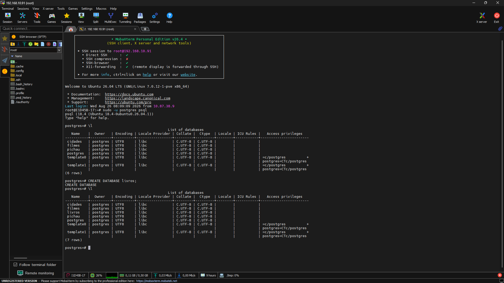
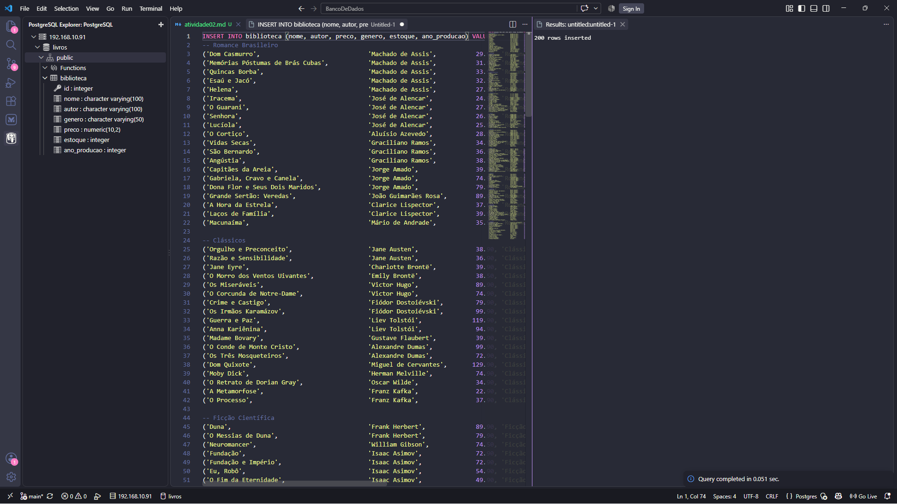
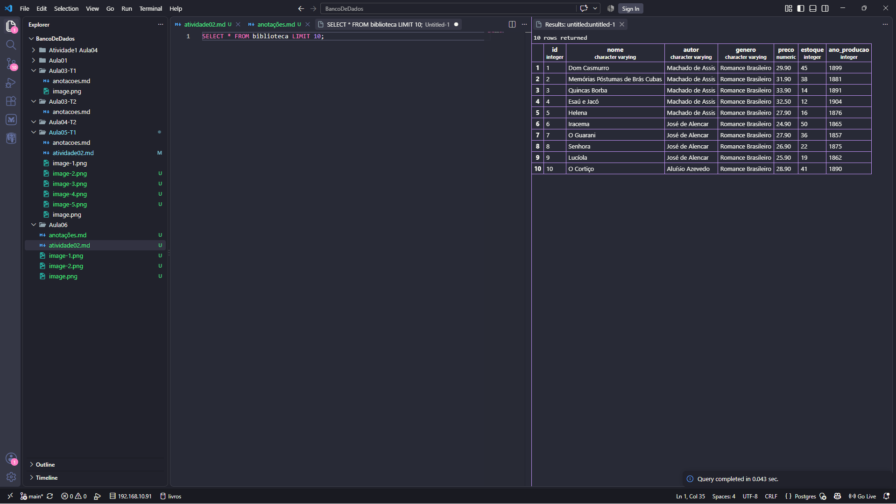
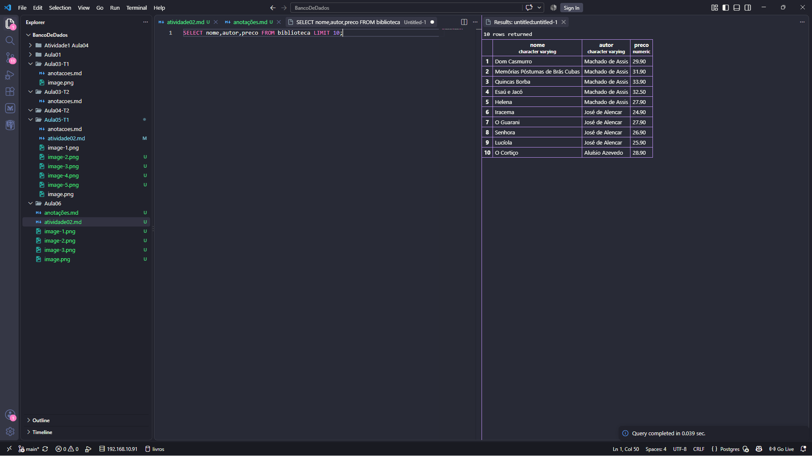

## Início:

-Crie um novo banco de dados para armazenar a tabela de livros 

-Crie uma tabela com as colunas (id,nome,autor,preco,genero,estoque,ano_publicacao)

-Lembre-se de escolher as variáveis adequadas!
Início:

## Exiba todos os dados da tabela, mas limitando o resultado aos 10 primeiros registros.

## Exibi apenas as colunas titulo, autor e preco de todos os livros.

 
## Listei os gêneros distintos existentes na base, em ordem alfabética.